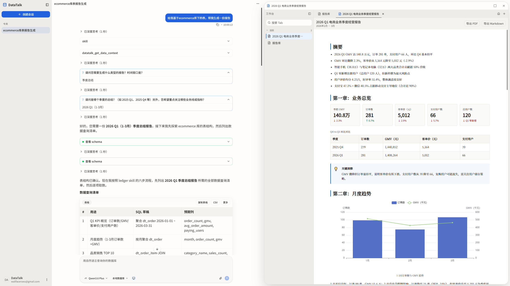

# DataTalk

AI-powered intelligent database collaboration platform. Query databases, generate SQL, and visualize data through natural language conversation — making data analysis as simple as chatting.



> 中文文档: [README.zh-CN.md](README.zh-CN.md)

## Highlights

- **Natural Language Queries** — Chat-driven interface: AI understands your business questions, generates and executes SQL automatically, and presents results as tables, charts, and dashboards
- **Multi-Database Support** — Covers MySQL, PostgreSQL, SQLite, DuckDB, ClickHouse, TiDB, MariaDB, OceanBase, StarRocks, Apache Doris, Trino, Presto, Oracle, SQL Server, Dameng, GaussDB, Apache Hive — 17+ data sources
- **Visual Workbench** — Multi-tab workspace with built-in SQL editor (Monaco), ER diagram designer/viewer, chart dashboards, data collection script editor, and more
- **Intelligent Diagnostics** — Automatic SQL error analysis, index suggestions, lock-wait detection, connection pool status, and tablespace monitoring
- **Semantic Model** — Maps business terms ("GMV", "average order value") to database queries, with support for verified query recording and reuse
- **Desktop Application** — Native desktop client built on Tauri v2, connect to local or remote databases

## Quick Start

### Prerequisites

| Dependency | Version |
|------------|---------|
| JDK | 21+ |
| Node.js | 22+ |
| Maven | 3.9+ |

### Start Backend

```bash
export JAVA_HOME=/path/to/jdk-21
cd server
mvn spring-boot:run -pl data-talk-adapter
```

The backend runs on `http://localhost:8080` by default.

### Start Frontend (Web Dev Mode)

```bash
cd client
npm install
npm run dev
```

### Start Tauri Desktop App

```bash
cd client
npm install
npm run tauri dev
```

### Run Tests

```bash
# Backend tests
cd server && mvn verify

# Frontend tests
cd client && npx vitest run
```

## Built-in Skills

DataTalk ships with 18 AI skills that define how AI operates on user databases, the workbench, and artifacts. Each skill corresponds to a SKILL.md file loaded by OpenCode at runtime.

### Data Query & Analysis

| Skill | Description | File |
|-------|-------------|------|
| **sql-execution** | Full SQL execution contract (SELECT/INSERT/UPDATE/CREATE/ALTER…ADD direct execution): DELETE triggers conversational `confirmationId`, destructive DDL (DROP/TRUNCATE/ALTER…DROP/GRANT/REVOKE etc.) is intercepted and `redirect_to_editor` for manual user execution | [SKILL.md](server/data-talk-adapter/src/main/resources/skills/sql-execution/SKILL.md) |
| **sql-error-diagnostics** | Automatic SQL error diagnosis: syntax errors, missing objects, ambiguous candidates, lock waits, slow queries, connection pool/tablespace issues | [SKILL.md](server/data-talk-adapter/src/main/resources/skills/sql-error-diagnostics/SKILL.md) |
| **exploring-data** | Pre-write exploration protocol: get_data_context → schema_search → read_schema → execute_sql exploration sequence and hit budget | [SKILL.md](server/data-talk-adapter/src/main/resources/skills/exploring-data/SKILL.md) |

### Connection & Dialects

| Skill | Description | File |
|-------|-------------|------|
| **connection-management** | Data source connection lifecycle management (create/test/edit/select), session data context switching, two-phase confirmation protocol | [SKILL.md](server/data-talk-adapter/src/main/resources/skills/connection-management/SKILL.md) |
| **database-dialects** | 17+ database dialect differences: connection types, default ports, JDBC drivers, schema visibility, SQL splitter, risk levels, ER/diagnostic support matrix | [SKILL.md](server/data-talk-adapter/src/main/resources/skills/database-dialects/SKILL.md) |

### Visualization & Output

| Skill | Description | File |
|-------|-------------|------|
| **bezel** | Production-grade dashboards: generates self-contained HTML from JSON descriptions (with embedded polling), embeddable as an iframe in DataTalk | [SKILL.md](server/data-talk-adapter/src/main/resources/skills/bezel/SKILL.md) |
| **charts-and-dashboards** | Charts/trends/KPIs/multi-component dashboards, supporting inline chart code blocks and persistent dashboard schemas | [SKILL.md](server/data-talk-adapter/src/main/resources/skills/charts-and-dashboards/SKILL.md) |
| **artifacts-output** | Artifact lifecycle management: temporary files vs. archive candidates, oversized response disk-offload continuation protocol | [SKILL.md](server/data-talk-adapter/src/main/resources/skills/artifacts-output/SKILL.md) |
| **ledger** | Enterprise report generation (monthly business review, incident postmortem, quarterly summary), with template rendering | [SKILL.md](server/data-talk-adapter/src/main/resources/skills/ledger/SKILL.md) |

### Workbench Interaction

| Skill | Description | File |
|-------|-------------|------|
| **query-editor-workflow** | SQL editor full lifecycle: create → set context → edit content → execute → focus, plus editor reuse rules | [SKILL.md](server/data-talk-adapter/src/main/resources/skills/query-editor-workflow/SKILL.md) |
| **tab-management** | Tab lifecycle and reuse strategy: library vs workset, cross-restart persistence, search and navigation | [SKILL.md](server/data-talk-adapter/src/main/resources/skills/tab-management/SKILL.md) |
| **ui-contract** | Four UI tool contracts (ui_find/ui_read/ui_patch/ui_exec) for discovering, inspecting, and editing workbench tabs | [SKILL.md](server/data-talk-adapter/src/main/resources/skills/ui-contract/SKILL.md) |
| **concurrency-contract** | Optimistic locking concurrency editing protocol: version conflict detection, 409 recovery flow, multi-edit batching | [SKILL.md](server/data-talk-adapter/src/main/resources/skills/concurrency-contract/SKILL.md) |

### Data Modeling

| Skill | Description | File |
|-------|-------------|------|
| **er-tabs** | ER diagram viewer (read-only + annotations) and ER designer (isolated schema drafts, producing DDL) | [SKILL.md](server/data-talk-adapter/src/main/resources/skills/er-tabs/SKILL.md) |
| **semantic-model-usage** | Semantic model usage: business term lookup, verified query recording/reuse, semantic change proposals | [SKILL.md](server/data-talk-adapter/src/main/resources/skills/semantic-model-usage/SKILL.md) |
| **skill-creator** | Create new semantic model skills (YAML) for business domains, defining business metrics and measures | [SKILL.md](server/data-talk-adapter/src/main/resources/skills/skill-creator/SKILL.md) |

### Data Engineering

| Skill | Description | File |
|-------|-------------|------|
| **data-collection** | Collect external data via Python/Node.js scripts and write to databases | [SKILL.md](server/data-talk-adapter/src/main/resources/skills/data-collection/SKILL.md) |
| **file-upload-routing** | File upload routing: dispatches uploaded files to corresponding processing actions based on pre-analysis summaries | [SKILL.md](server/data-talk-adapter/src/main/resources/skills/file-upload-routing/SKILL.md) |

## Tech Stack

| Layer | Technology |
|-------|------------|
| Desktop Client | Tauri v2, React 19, Vite, TanStack Router/Query, Zustand, shadcn/ui, Tailwind CSS v4, Monaco Editor, Recharts |
| Backend Service | Spring Boot 3.5, Java 21 (Virtual Threads), JdbcTemplate, Flyway, SQLite (metadata) |
| AI Communication | OpenCode Protocol (Streamable HTTP + SSE, JSON-RPC) |
| User Databases | Dynamic JDBC connection pools, 17+ data sources supported |

## Documentation Index

| Document | Description |
|----------|-------------|
| [CLAUDE.md](CLAUDE.md) | Development guide & working rules |
| [ARCHITECTURE.md](ARCHITECTURE.md) | System architecture overview |
| [docs/FRONTEND.md](docs/FRONTEND.md) | Frontend development guide |
| [docs/BACKEND.md](docs/BACKEND.md) | Backend development guide |
| [docs/DESIGN.md](docs/DESIGN.md) | Design patterns & conventions |
| [docs/design-docs/index.md](docs/design-docs/index.md) | Design document index |
| [docs/bugs/index.md](docs/bugs/index.md) | Bug tracking & defect registry |
| [docs/DATA_SOURCE_TYPE_COMPATIBILITY.md](docs/DATA_SOURCE_TYPE_COMPATIBILITY.md) | Data source type compatibility matrix |
| [docs/QUALITY.md](docs/QUALITY.md) | Quality standards & scoring |
| [docs/RELIABILITY.md](docs/RELIABILITY.md) | Reliability practices |
| [docs/SECURITY.md](docs/SECURITY.md) | Security guide |
| [docs/I18N.md](docs/I18N.md) | Internationalization guide |
| [client/DESIGN.md](client/DESIGN.md) | Frontend design contract |
