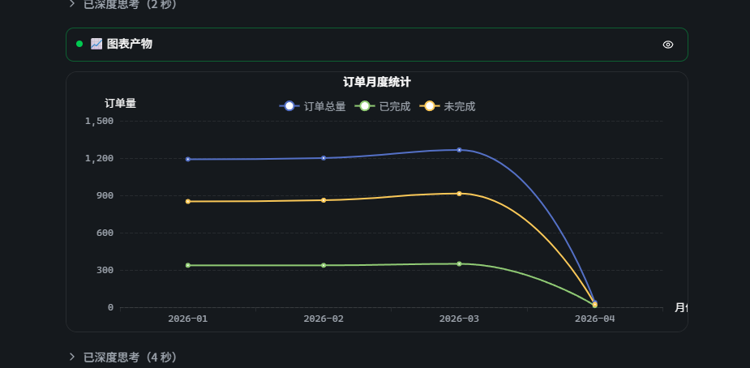
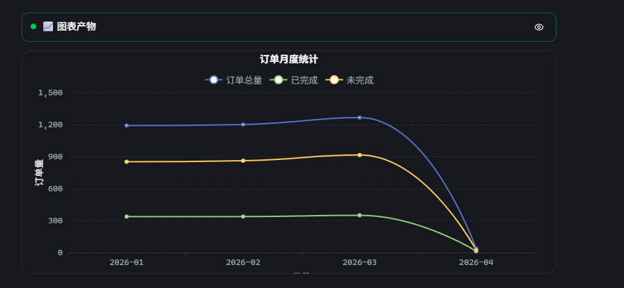
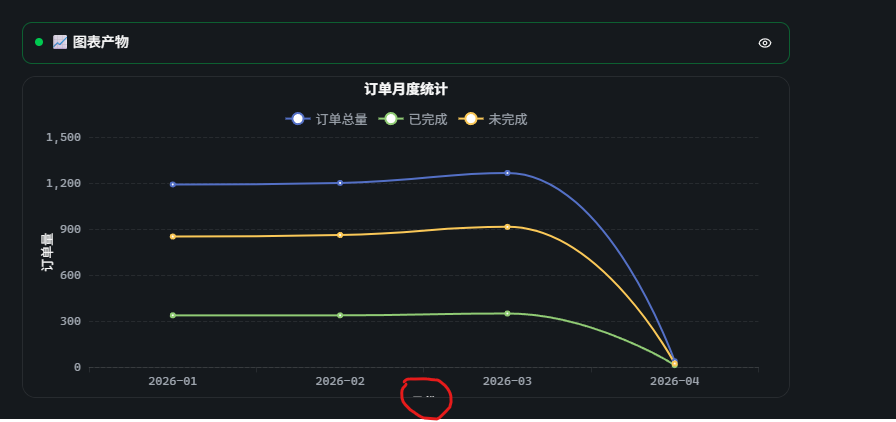

## Summary

当 AI 生成的 ECharts option 包含 `xAxis.name`（例如 "月份"）时，echarts 默认 `nameLocation: 'end'` 会把标题画在 X 轴右端外侧；在聊天气泡的窄容器（`chart-block.tsx` 外层 `max-w-full overflow-hidden`，且气泡宽度是产品契约不可改）下，标题溢出 grid 右边界、被 echarts canvas 自身裁切，肉眼只看到首字。Y 轴 `name` 同问题潜在存在。

## Reproduction Steps

1. 在 chat 中让 AI 生成一张 line/bar 图，option 形如：
   ```json
   {
     "title": { "text": "订单月度统计" },
     "xAxis": { "type": "category", "name": "月份", "data": ["2026-01","2026-02","2026-03","2026-04"] },
     "yAxis": { "type": "value", "name": "订单量" },
     "series": [ { "type": "line", "data": [1200, 1210, 1245, 30] } ]
   }
   ```
2. 等待图表产物（chart artifact）渲染到聊天气泡。
3. 观察 X 轴右端的标题。

## Expected vs Actual

- **Expected**: X 轴标题 "月份" 完整可见。
- **Actual**: 仅显示 "月"，"份" 字被气泡右边界 + canvas 边界裁掉。

## Environment

- Backend commit: 5fb4dd7（develop）
- Frontend commit: 5fb4dd7（develop）
- OS / Browser: Windows 10 + WSL2 dev / Tauri webview（Edge WebView2）
- Data source: N/A（图表渲染为纯前端，与数据源无关）

## Evidence

-  — 初次发现：折线图 "订单月度统计"，X 轴标题 "月份" 仅显示 "月"（被气泡右边界裁切）。
-  — v1 修复后回归：Y 轴 "订单量" 居中竖排正确，但 X 轴 "月份" 被画到 canvas 底部之外，仅露出文字顶部 1-2px（grid.bottom 不够装下 axisLabel + nameGap + name 文字高度）。
-  — v3 (`grid.bottom=80`) 后用户回归：X 轴 axisLabel "2026-01..." 下方居中位置仍仅显露文字底部约 10%（红圈位置）。说明在 chart-renderer DEFAULT_HEIGHT=320 这个总高度约束下，无论怎么调 `grid.bottom`，echarts 内部 layout 都不能给 `axis.name` 留出完整可读区域 —— 这是 systematic-debugging 第 4 阶段的"3 次失败 = 架构问题"信号。

## Root Cause

**三层成因，需三步同时修复（v4 收敛）：**

1. **轴 name 默认贴边**：ECharts 的 `xAxis.name` 默认 `nameLocation: 'end'`，渲染在 X 轴右端**之外**；同理 `yAxis.name` 默认贴顶。`chart-block.tsx` 外层容器是产品契约固定宽度（`max-w-full overflow-hidden`），且 `chart-renderer.tsx` 让 canvas 跟随 `width: 100%`，name 文字超出 canvas 边界即被裁。

2. **`containLabel` 不照顾 axis.name**：`chart-theme.ts` 的 `withContainLabel` 仅给 `grid.containLabel = true` —— 但该选项**只**为 `axisLabel`（刻度数字）腾空间，**不**为 `axis.name` 腾空间。即便把 name 改成 `nameLocation:'middle'`，echarts 默认 `grid.bottom` 也不够装下 axisLabel + nameGap + name 文字高度，name 仍会被画到 canvas 底部之外。Y 轴 + nameRotate:90 同理需要更宽的 `grid.left`。

3. **总 canvas 高度约束**：`chart-renderer` 的 `DEFAULT_HEIGHT = 320` 在容纳 title + legend + 绘图区 + axisLabel 后，留给 axis name 的垂直空间不足。即便 `grid.bottom` 加大到 80，echarts 内部实际 layout 仍把 name 推近 canvas 底边、被裁切（user reported 仅展示字体 10%）。本质上是单纯调 grid padding 在 320px 总高度内做"零和博弈"——压缩绘图区的同时，echarts 自己又会限制 grid 比例，没有真正给 axis name 多留空间。**只有抬高总 canvas 才能根本解决。**

第二层、第三层成因分别是 v1 → v2 → v3 → v4 失败链上发现的，符合 systematic-debugging 第 4 阶段"3 次失败 = 架构问题"原则。

## Fix

`client/src/features/chat/components/markdown/chart-theme.ts` 的 `injectOptionFix` 增加两步产品级规范化，与既有 `withCenteredPie` / `withTransparentTitle` 同层：

**步骤 A — `withInsetAxisName(axis, dim)`**：
- 对 `xAxis` / `yAxis`（含数组双轴），若条目存在非空 `name`，强制：
  - `nameLocation: 'middle'`
  - `nameGap: 28`（X 轴）/ `36`（Y 轴）
  - Y 轴额外加 `nameRotate: 90`（中/英文均能竖排居中）
- 空 / 无 `name` 的条目原样保留。

**步骤 B — 升级 `withContainLabel(grid, option)`**：
- 检测 `option.xAxis` 是否有非空 `name`：是则给 grid 注入 `bottom: 96`（v5：**无条件覆盖**，即使 AI 显式设置过）。
- 检测 `option.yAxis` 是否有非空 `name`：是则给 grid 注入 `left: 96`（v5：**无条件覆盖**）。
- 数值在 `chart-renderer` 新默认 `height=360`（v4 抬高）下的几何估算：
  - bottom ≥ axisLabel band(~22) + nameGap(28) + name fontHeight(~14) + 安全余量(~32) = 96
  - left   ≥ axisLabel band(~40) + nameGap(36) + name fontHeight(~14) + 安全余量(~6)  = 96
- 安全余量在 v4 大幅增加（v3 仅 ~16），覆盖 echarts 实际几何与教科书估算的偏差。
- v4 使用 `result.bottom === undefined` 守卫，但 AI 会显式生成 `grid.bottom: "3%"` 等过小值绕过守卫。v5 移除守卫，始终覆盖。
- 没有任何 axis name 时只加 `containLabel: true`，不注入 padding，行为与改造前一致。

**步骤 C — 抬高 `chart-renderer.DEFAULT_HEIGHT` 320 → 360（v4 新增）**：
- chat 气泡内的 chart artifact、artifact-created、artifact-ref-block 默认 +40px 垂直空间。
- 不影响 modal（`chart-expand-modal` 用 `getModalChartHeight()`）/ dashboard widget（`chart-widget` 传 prop）/ ontology artifact（`chart-artifact` 传 prop）—— 它们都显式传 height。
- 这是从"在 320 内挤"切到"给 echarts layout 充足余量"的架构转折，避免再次陷入"加 grid padding → 又被裁 → 再加"的死循环。

**改动文件（v4 收敛态）：**

- `client/src/features/chat/components/markdown/chart-theme.ts`：新增 `withInsetAxisName(axis, dim)` + `hasAxisWithName(axis)` 辅助；`withContainLabel` 升级为 `withContainLabel(grid, option)`，根据轴 name 决定是否扩 padding。常量 `GRID_BOTTOM_FOR_X_NAME = 96` / `GRID_LEFT_FOR_Y_NAME = 96`。
- `client/src/features/chat/components/markdown/chart-renderer.tsx`：`DEFAULT_HEIGHT` 320 → 360（v4 新增）。
- `client/src/features/chat/components/markdown/__tests__/chart-theme.test.ts`：8 个用例
  - X 轴有 `name` → middle + nameGap，其余字段保留
  - Y 轴有 `name` → middle + nameRotate:90 + nameGap
  - 空 / 无 `name` → 不被改造
  - `xAxis` 数组（双轴）→ 只规范有 `name` 的条目
  - 有 X name → grid.bottom ≥ 88（v4 收紧：实际 96）
  - 有 Y name → grid.left ≥ 88（v4 收紧：实际 96）
  - AI 显式设置过小 grid 值（如 `"3%"`）→ 被覆盖为 96（v5 新增）
  - 无 axis name → grid 不注入 bottom/left（行为不变）
- `client/src/features/chat/components/markdown/__tests__/chart-renderer.test.tsx`：新增 1 个用例 — DEFAULT_HEIGHT ≥ 360。

## Verification

- 单元测试：`npx vitest run src/features/chat/components/markdown/__tests__/chart-theme.test.ts` → 15/15 通过（含新增 8 例：v1 轴 name 4 例 + v2/v3/v4 grid padding 4 例，v4 收紧了 grid.bottom / grid.left 下界到 ≥ 88）
- chart-renderer 回归：`npx vitest run src/features/chat/components/markdown/__tests__/chart-renderer.test.tsx` → 2/2 通过（含新增 DEFAULT_HEIGHT ≥ 360 用例）
- 全 markdown 模块回归：`npx vitest run src/features/chat/components/markdown` → 76/76 通过（10 个测试文件）
- 类型检查：`npx tsc --noEmit` 在本次改动文件上 0 报错（仓库其他既存 TS6133 在 `multi-mode-connection-fields.test.tsx`，与本改动无关；已通过 `git stash` 验证为预存在）
- 手测（待 Tauri/E2E 真实验证）：在与截图同款会话下确认 X/Y 轴标题完整显示、轴方向居中、不再被 canvas 边界裁切
- Playwright E2E（v5 验证）：在 "常见数据库类型概览" 会话底部多指标柱状图上，通过 React fiber 检查确认 `grid: { containLabel: true, left: 96, right: "4%", bottom: 96 }` 已注入，X 轴 "月份" 和 Y 轴 "订单量" 完整可见

## Notes

- 不改气泡宽度（产品契约）；不改 `chart-block.tsx`、`chart-renderer.tsx`；不改 AI prompt。
- 与既有 `withCenteredPie` / `withTransparentTitle` 同质 —— 都是 echarts option 的产品级规范化。
- **修复迭代记录**：
  - v1（仅做 `withInsetAxisName`）→ X 轴 name 被画到 canvas 底部之外（`screenshot-02-after-v1.png`），根因是 `containLabel` 不为 `axis.name` 腾空间。
  - v2（`grid.bottom:56` / `grid.left:72`）→ 56px 在 echarts containLabel 把 axisLabel 算进 grid 矩形后留给 name 的实际带宽不足，name 中心几乎贴 canvas 底、下半截被裁。
  - v3（`grid.bottom:80` / `grid.left:88`）→ 用户回归仍报 X 轴下方文字仅展示约 10%（`screenshot-03-after-v3.png`）。这是连续第三次单纯调"grid padding"的修复失败，触发 systematic-debugging 第 4 阶段的"3 次失败 = 架构问题"信号。
  - v4（架构调整）：跳出"在 320px 总高度内调比例"的死循环，把 `chart-renderer.DEFAULT_HEIGHT` 抬到 360，并把 grid padding 提到 96/96。给 echarts 真正的垂直余量而不是继续压缩绘图区。同步收紧测试断言到 ≥ 88（grid）/ ≥ 360（DEFAULT_HEIGHT）防回退。但 v4 的守卫 `result.bottom === undefined` 允许 AI 显式小值通过。
  - v5（守卫移除）：AI 生成的 option 包含 `grid: { bottom: "3%", left: "3%" }`，`"3%"` ≠ `undefined` 绕过了 v4 守卫，导致 X 轴标题仍然被裁。移除 `=== undefined` 守卫，当 axis name 存在时**无条件**覆盖 grid.bottom/left 为 96。Playwright E2E 验证通过：多指标柱状图（订单总量/已完成/未完成）X 轴 "月份"、Y 轴 "订单量" 均完整可见。
- jsdom 不做布局，所以"name 不再被裁"的最终视觉证据需要 Tauri/E2E 验证（参见 user memory `feedback-jsdom-layout-not-truth.md`）。单测仅锁住 option-shape 契约（`grid.bottom` / `grid.left` / `nameLocation` / `nameGap` / `nameRotate`）。
- 若后续 AI prompt 显式指定 `nameLocation: 'end'`，本规范化仍会覆盖为 `'middle'` —— 这是有意为之，与产品契约一致。
- 状态置 `fixed`：代码改动已就绪，等本次会话提交后回填 `fixCommit`；进入 `verified` 需 Tauri 端复现该截图同款 option 并目视确认。
