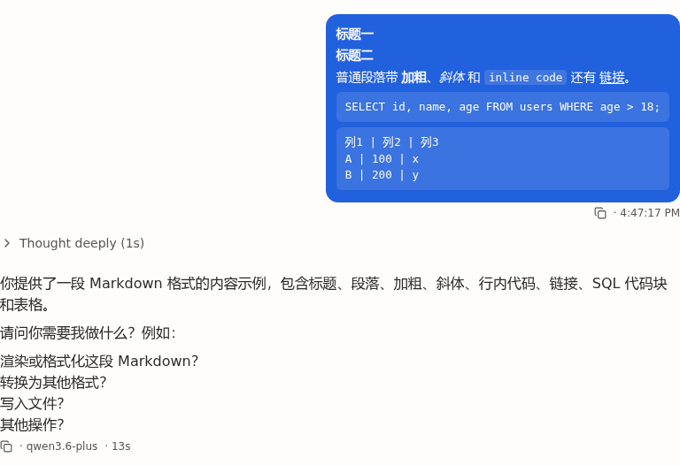
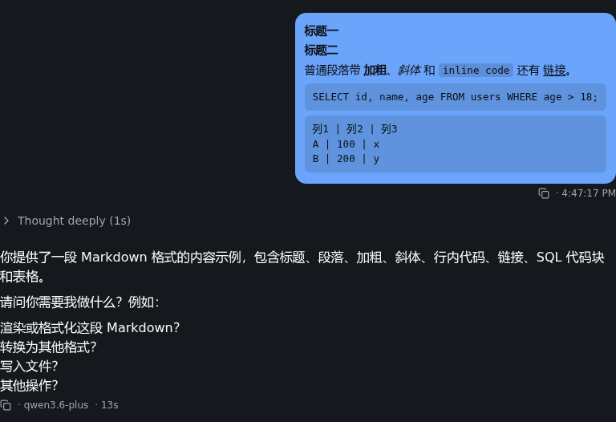

## Summary

用户气泡（UserBubble）内的 `<Markdown>` 组件在渲染 fenced code block、markdown 表格、内联 code 时，背景跟随全局 `--background` / `--muted` token（浅色），而文字色被气泡容器强制设为 `text-primary-foreground`（浅色主题下为白色），导致代码块/表格区域白字白底不可见。dark 主题下气泡 foreground 是深色而 `--background` 仍是 dark canvas，对比度同样不足。

## Reproduction Steps

1. 启动 client dev server，新建一个 chat session
2. 在 composer 输入包含 fenced code block 与 markdown 表格的多元素消息，例如：

   ```
   # 标题
   普通段落带 `inline code`

   ```sql
   SELECT id FROM users;
   ```

   | A | B | C |
   |---|---|---|
   | 1 | 2 | 3 |
   ```
3. 发送，观察自己的 user bubble
4. 切换浅色 / 深色主题分别观察

## Expected vs Actual

- **Expected**: 用户气泡内所有文本（含代码块、表格、内联 code）在两种主题下都可读，与气泡容器配色一致
- **Actual**: 代码块容器套上白色渐变（`[data-component="markdown-code"]` 的 light 渐变背景），表格头/体也是浅色背景；继承的 `text-primary-foreground` 白色文字与白底背景同色，几乎不可见。深色主题下气泡前景是深色而代码块容器仍是 light 系底色，呈现深字深底，同样难以阅读

## Environment

- Backend commit: 522616f7
- Frontend commit: 522616f7（本 BUG 修复前）
- OS / Browser: Linux WSL2 + Chromium (Playwright)
- Data source: N/A（纯前端渲染问题）

## Evidence

-  — 浅色主题下用户气泡：标题降级为加粗段落，inline code / pre 用半透明 currentColor 背景，全部清晰可读
-  — 深色主题下用户气泡：亮蓝底 + 深色文字，inline code / pre 同样自适应继承色

## Root Cause

`client/src/features/chat/components/markdown/markdown.tsx` 中 `decorateCodeBlocks` 与 `decorateTables` 无条件执行，即便 user-bubble 传入 `disableActions=true` 也会被装饰：

- `decorateCodeBlocks` 把 `<pre><code>` 包成 `[data-component="markdown-code"]` 容器，CSS 里该容器有 light 系渐变背景（`linear-gradient(180deg, var(--background) ...)`），它不感知调用方文字色
- `decorateTables` 把 `<table>` 包成 `[data-component="markdown-table"]` 容器并加 light 系表头背景
- `markdown.css` 中 `[data-component="markdown"] :not(pre) > code` 内联代码样式直接用 `var(--muted)` 浅色背景

UserBubble 容器是 `bg-primary text-primary-foreground`，把文字色强制为反相浅色（light 主题下白色，dark 主题下深色），但装饰元素的背景使用全局 token，两者从不协调。

## Fix

引入 `variant: 'plain' | 'rich'`（默认 `'rich'`）prop 取代原本只服务于此场景的 `disableActions`，并新增 `plainifyComplexBlocks`：

- `markdown.tsx`：plain 模式下完全跳过 `decorateChartBlocks` / `decorateDashboardBlocks` / `decorateCodeBlocks` / `decorateSqlBlocks` / `decorateTables`，改为调用 `plainifyComplexBlocks` 把 `<pre><code>` / `<table>` / `<h1-6>` 改写为 `<pre data-plain-code>` / 加粗段落，根容器写 `data-variant="plain"`
- `markdown.css`：新增 `[data-component="markdown"][data-variant="plain"]` 段落，内联 `<code>` 与 `<pre[data-plain-code]>` 都用 `background: color-mix(in srgb, currentColor 12-14%, transparent); color: inherit`，跟随 `currentColor` 自适应任意文字色，浅色 / 深色主题与气泡反相场景一律可读；链接同样 `color: inherit + underline`
- `user-bubble.tsx`：两处 `disableActions` 替换为 `variant="plain"`（`isBangQueryUser` 路径同样切换）

设计取舍：用户气泡场景的输入端几乎不会写多行 fenced code 与 markdown 表格，bang query (`!sql`) 已走独立 SQL Tab 路径；与其投精力做反相主题适配，不如砍掉复杂结构，得到稳定的双主题表现。

## Verification

- `npx tsc --noEmit` exit=0
- 手动 Playwright 端到端：浅色主题与深色主题分别截图（见 Evidence），用户气泡内：
  - inline code 半透明 currentColor 底，文字继承气泡前景色，清晰可见
  - fenced code 块退化为 `<pre data-plain-code>`，等宽多行、半透明继承色背景
  - markdown 表格退化为 `<pre data-plain-code>` 多行 `a | b | c` 形式
  - 标题降级为 `<strong>` 段落
  - 链接、加粗、斜体等内联格式继续生效
- DOM 检查：`[data-component="markdown-code"]` / `[data-component="markdown-table"]` / `[data-component="markdown-chart"]` 在 plain variant 下计数 = 0

## Notes

- `disableActions` 是仅服务于本场景的 boolean prop，已无外部消费者，本次直接重命名为更明确的 `variant`，未保留兼容垫片
- 如未来需要在用户气泡中保留 fenced code 的 syntax 高亮，可新增第三个 `variant`（如 `'inverse'`）并为代码块/表格容器写一套反相 token，本次不做
