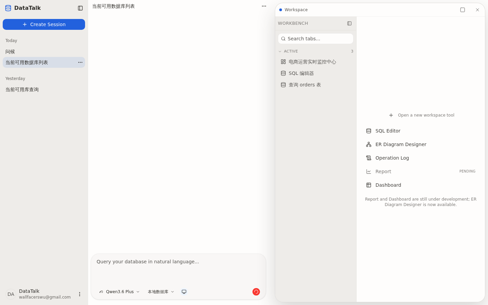
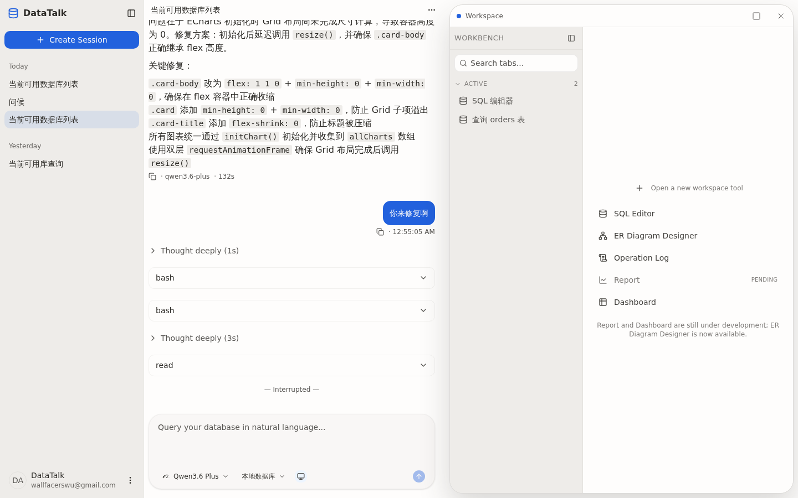

## Summary

会话在 OpenCode 端处于 `busy` 状态（无论是真在 streaming 还是上一轮 idle 丢失导致的"幽灵 busy"）时，进入该会话画布永远是空白：聊天容器渲染 0 条 turn，但后端 `/messages` 实际返回了完整历史（本例 33 条、315KB）。表面像"消息没渲染出来"，实质是 `shouldSkipReplace` 在 `streamingBySession.has(sessionId)` 为 true 时无条件丢弃整份历史 replace，而 `useSessionSubscribe` 与 `useSessionHistory` 是两个独立 effect，前者的 `setStreaming(true)` 会与后者的 `replaceSession` 竞争，会话越大、`/messages` 越慢，越容易输给 `/status` 这一小响应，结果先立 flag 再丢历史。

## Reproduction Steps

1. 打开 DataTalk 客户端（前端 dev `http://localhost:1420`，后端 `:8080`）。
2. 选择一个已经发过多轮对话的会话（如本次复现使用的 `当前可用数据库列表`，OpenCode 端会话状态 = `busy`，累计 9742 个 SSE 事件、33 条 message）。
3. 观察主区域：仅有标题栏、composer 与底部"滚动到底部"按钮，消息容器 `<div class="mx-auto w-full min-w-0 max-w-3xl">` 完全空。
4. 切换到另一个会话再切回来，问题依旧。
5. 直接 `curl http://localhost:8080/api/sessions/<id>/messages` 可以拿到完整 33 条消息 JSON——后端无问题。
6. `curl http://localhost:8080/api/sessions/<id>/status` 返回 `{"type":"busy"}`——根因触发条件。

## Expected vs Actual

- **Expected**: 进入会话后，历史 33 条消息（9 user + 24 assistant，包含 reasoning / tool / text parts）应当渲染出来；若服务端确认 streaming 中，最近一条 assistant turn 顶部应继续显示流式占位/进度，而不是直接把整段历史扔掉。
- **Actual**: 主区域消息列表常驻空白，console 无渲染异常，仅有两条来源是旧 `d3347f5c-...` sessionId 的 `/data-context` 404（与本 BUG 无直接关系，是另一处冷启动残留请求）。Network 显示 `/messages` 200、`/status` 200(busy)、`/channel` 200。

## Environment

- Backend commit: 77e20cdc (develop)
- Frontend commit: 77e20cdc (develop)
- OS / Browser: WSL2 / Linux 6.6.87.2 / Chromium (Playwright MCP)
- Data source: N/A（仅前端 + chat 历史展示问题）
- 复现会话 ID: `c988708c-a175-4159-ab03-27e505602fb4`（`hasEverSent=true`，updatedAt 2026-05-15 23:35）
- `data-talk.channel` sessionStorage 中 `lastEventIdBySession[c988...] = 9742`（事件量级佐证"内容超多"）

## Evidence

-  — 修复前：进入「当前可用数据库列表」后主区域无任何消息气泡，仅标题 / composer / 下滚按钮
-  — 修复后：同一会话同一刻进入，9 个 turn 全部渲染，工具调用、表格、模型时序信息齐全
- 后端响应：
  - `GET /api/sessions/c988708c.../messages` → 200，size=315436 字节，`length=33`，`roles={'user':9, 'assistant':24}`
  - `GET /api/sessions/c988708c.../status` → 200，`{"type":"busy"}`（由 `SessionStatusController` 透传 OpenCode 真实状态）
  - `GET /api/sessions/c988708c.../channel` → 200（SSE 订阅成功，但订阅成功也救不了，因为 history 已经被丢弃）
- 前端 DOM 现场（截取自 `<main>` 内）：
  ```html
  <div class="flex-1 overflow-x-hidden overflow-y-auto px-2 py-4">
    <div class="mx-auto w-full min-w-0 max-w-3xl"></div>  <!-- 永远空 -->
  </div>
  ```
- sessionStorage 关键字段：
  ```json
  {
    "data-talk.chat-parts": { "state": {}, "version": 0 },        // partialize 返回 {}，正常
    "data-talk.channel": { "state": { "lastEventIdBySession": { "c988708c-...": 9742 } } }
  }
  ```
- console（仅冷启动残留 404，无渲染/反序列化错误）：
  ```
  ERROR  http://192.168.1.3:8080/api/sessions/d3347f5c-.../data-context  404
  ERROR  http://localhost:1420/favicon.ico  404
  ```

## Root Cause

涉及三段代码，叠加构成 race：

1. `client/src/features/session/hooks/use-session-history.ts:16-25` — `shouldSkipReplace` 把 "streaming 中" 当成"必须放弃 server snapshot"：
   ```ts
   function shouldSkipReplace(sessionId, serverMsgCount, serverArtifactCount) {
     const partsStore = useChatPartsStore.getState()
     if (partsStore.streamingBySession.has(sessionId)) return true     // ← 元凶
     const storeMsgCount = partsStore.infoBySession.get(sessionId)?.size ?? 0
     ...
   }
   ```
   设计假设是"streaming 时 store 已经有数据（optimistic + SSE），不要被 stale fetch 覆盖"。但首次进入会话时 store 是空的，这条早返回直接把唯一一份完整历史也丢掉。

2. `client/src/features/session/hooks/use-session-subscribe.ts:40-52` — 自己注释承认了顺序敏感性："`setStreaming(true)` must happen **after** history has been loaded by useSessionHistory's effect"，但实现并没有真正给到这个顺序保证：
   ```ts
   void (async () => {
     const status = await fetchSessionStatus(sessionId)  // 几十字节，<50ms
     if (status.type === 'busy' || status.type === 'retry') {
       useChatPartsStore.getState().setStreaming(sessionId, true)  // ← 抢跑
     }
     ...
   })()
   ```
   而 `useSessionHistory` 是另一个组件 / 另一个 `useEffect`，触发 `replaceSession` 还要等 `/messages`(315KB) + `/artifacts` 两个 useQuery 都 resolve + effect 跑完。

3. `server/data-talk-infrastructure/.../SessionStatusController.java:37-53` — 后端直接透传 OpenCode 的 session status。OpenCode 一旦丢失 `session.idle` 事件（参考 BUG-0038 的同类型路径），这个会话就永久卡在 busy，前端永远走第 1 步的早返回。

合起来：**"历史是否替换 store" 与 "streaming flag 是否立起来" 没有共享时序保障，于是 `/status` 的响应稳定先于 `/messages`，flag 先立、history 后到、replace 被拒、UI 永空**。  
而且即便没有 race，本身的设计也是错的——streaming 中"既要保留乐观数据，又要展示历史"应该是 reducer 层面的 merge，而不是"流式中就整块拒绝服务端 snapshot"。

与 BUG-0046 / BUG-0037 / BUG-0038 是同一脉络（streaming flag 与历史 / SSE 的状态机交互），但触发点不同：那批 BUG 关心 CTRL+R 之后按钮态错乱；本 BUG 是首次进入大会话时消息体本身就消失。

## Fix

选取最小改动方案（选项 A）。提交 `ad7c6a2b` 修改 `client/src/features/session/hooks/use-session-history.ts:16-25` 的 `shouldSkipReplace`：

```diff
- if (partsStore.streamingBySession.has(sessionId)) return true
  const storeMsgCount = partsStore.infoBySession.get(sessionId)?.size ?? 0
+ if (partsStore.streamingBySession.has(sessionId) && storeMsgCount > 0) return true
```

streaming guard 改为"streaming + store 非空"才跳过——本质是回到这个 guard 的设计意图（保护乐观/in-flight 数据），空 store 没有数据可保护，不该被锁死。这同时消除了与 `use-session-subscribe.ts:40-47` 的时序依赖，注释里的"`setStreaming(true)` must happen after history has been loaded"不再是隐性约束。

未选 B（重排 effect 时序）：跨 hook 同步会引入新 race；A 已经把症状从根上解掉。  
未选 C（后端 OpenCode 端 reconcile 幽灵 busy）：超出本 BUG 范围；与 BUG-0038 同源，可独立立项。

测试同提交补 `client/src/features/session/hooks/__tests__/use-session-history.test.tsx`：新增 `loads server history on first entry even when streaming flag is set (race fix)`，验证空 store + streaming=true 时 server snapshot 仍会 replace。三条既有保护（pending user、post-stream remount、空 server snapshot）测试不动且全部继续通过。

## Verification

- 单元测试：`npx vitest run src/features/session/hooks/__tests__/use-session-history.test.tsx` 6/6 通过（含新增 race-fix 用例）；相关链路（chat-parts-store、use-background-session-subscribe、prompt-composer 等）65/65 通过。
- 类型检查：`npx tsc --noEmit` exit 0。
- E2E 实证：以同一 `c988708c-...` 会话（OpenCode 端仍 `busy`，sessionStorage 中游标 `lastEventIdBySession=9742`）再次进入，主区域 `<main>` 文本量从 258 字节 → 4046 字节，消息容器从 0 children → 1 children (`flex min-w-0 flex-col gap-2`)，内含 **9 个 turn**（精确对应后端 9 条 user message），包含 reasoning 段、`datatalk_list_connections` 等工具调用、表格 / Markdown 等富内容。截图见 `screenshot-02-after-fix.png`。

## Notes

- 本 BUG 与 [BUG-0046](BUG-0046-composer-button-refresh-stream-state-mismatch.md) / [BUG-0038](BUG-0038-replay-idle-on-resubscribe-clears-streaming-flag.md) 共享同一组核心组件（`use-session-history` + `use-session-subscribe` + `chat-parts-store.streamingBySession`），是同一状态机暴露出来的第三种 race 形态。修复时建议把这三类场景作为一组测试用例统一收口。
- 控制台里能看到的两条 `/data-context` 404 来自一个**已删除/无效**的会话 ID（`d3347f5c-...`），不属于本 BUG，但提示存在另一处冷启动残留请求（建议另立 BUG / tech-debt）。
- 复现期间 OpenCode 端 9742 个事件已堆积，刷新页面后 `lastEventIdBySession` 仍记得游标，可作为定位 streaming 实际是否还活着的辅助证据。
