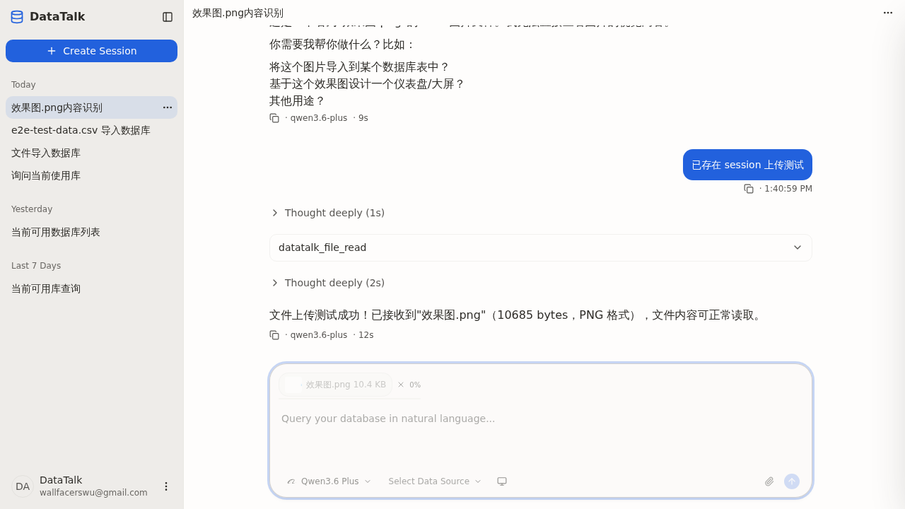

## Summary

用户上传图片并发送消息后，气泡上方的 `BubbleAttachmentList`（以及历史版本气泡内的 `FileUploadCard`）**永远不渲染**。根本原因：`ChannelService.partForWire` 把 `FileUploadPart` 显式降级为 OpenCode `text` part（commit `392d3834` 引入的 OpenCode Zod 兼容方案），OpenCode 持久化的 user message 只有 text — 当 SSE 流回放用户消息时，前端 `chat-parts-store` 收到的 parts **完全没有 `file_upload` 类型**。这使得 `user-bubble.tsx` 中 `parts.filter(p => p.type === 'file_upload')` 在任何时刻都为空数组。

这是一个 architectural 协议层缺口：DataTalk 把 file_upload 上传走 OpenCode 之外的独立链路（POST `/api/files/upload`），但 user message 的"chat-side echo"必须经 OpenCode 回放 — 而 OpenCode 不识别 file_upload。

## Reproduction Steps

1. 启动 backend (`mvn spring-boot:run -pl data-talk-adapter`) 与 web 前端 (`npm run dev`，端口 1420)
2. 浏览器打开 http://localhost:1420/
3. 创建或选中任一已存在 session
4. 点击输入框 "Attach files" → 选择一张图片（或 setInputFiles to hidden `<input type=file>`）
5. 观察输入框内出现 `FileAttachmentChip`（缩略图 + 文件名 + X 删除）✓ 正常
6. 在 textarea 输入任意文本（如 "这是什么"）→ Enter 发送
7. 等待 backend 处理完成 + AI 回复完成（约 5–12s）
8. 观察用户气泡

## Expected vs Actual

- **Expected**：用户气泡上方出现 `BubbleAttachmentList`（横向 chip 列表，含图片缩略图 + 文件名 + 类型/大小），单击可弹出 `FilePreviewDialog`
- **Actual**：用户气泡父容器只有 2 个 children：气泡本体（含文本）+ meta 行（Copy / timestamp）。**`BubbleAttachmentList` DOM 不存在**。React fiber 中 `parts` 数组全部是 `{ type: 'text' }`，无 `file_upload`

## Environment

- Backend commit: `96534040` (develop)
- Frontend commit: `96534040` (develop) + 本地 user-bubble-attachments 变更
- OS / Browser: WSL Ubuntu / Headless Chromium (playwright-cli 0.1.13)
- Data source: N/A（与 JDBC 数据源无关）

## Evidence

-  — 输入框 chip 正常显示但气泡上方无 BubbleAttachmentList

- 发送出去的 HTTP body（**正确**带了 file_upload part）：
  ```json
  {
    "method": "send_message",
    "params": {
      "parts": [
        { "type": "text", "text": "已存在 session 上传测试" },
        { "type": "file_upload", "fileId": "3bae6968-...", "filename": "效果图.png", "mimeType": "image/png", "sizeBytes": 10685, "analysis": {...} }
      ]
    }
  }
  ```

- 用户气泡父容器 DOM（缺少 chip 兄弟节点）：
  ```
  parentChildCount: 2
  siblings: [
    "relative max-w-[85%] rounded-lg ... bg-primary",   // 气泡本体
    "flex items-center gap-2 text-xs text-muted-foreground"  // meta 行
  ]
  ```

- React fiber `parts` props 实际值：
  ```js
  [
    { type: "text" },
    { type: "text" }   // ← file_upload 在此处缺失
  ]
  ```

## Root Cause

`server/data-talk-application/src/main/java/com/datatalk/application/channel/ChannelService.java` 第 138–144 行（commit `392d3834` 引入）：

```java
if (p instanceof FileUploadPart u) {
    // OpenCode strict Zod validation rejects custom fields (fileId, analysis, sizeBytes).
    // Convert to a text part so the AI sees the metadata and can call datatalk_file_read.
    out.put("type", "text");
    out.put("text", buildFileUploadContext(u));
    return out;
}
```

完整链路：

```
[前端 POST]
   parts = [text, file_upload]
        │
        ▼
[DataTalk ChannelService.sendMessage]
   bus.publish(SessionStatus busy)          ← 仅 status，未 publish parts
   gateway.forwardUserMessage(ocSid, body)  ← partForWire 把 file_upload → text
        │
        ▼
[OpenCode 持久化的 user message]
   parts = [text, text]
   (含 "[Uploaded file: 效果图.png | fileId: ... | ...]" 文本)
        │
        ▼
[OpenCode SSE 回放给 DataTalk → 前端]
   message.part.created → { type: "text", ... } × 2
        │
        ▼
[前端 chat-parts-store]
   partsBySession.set(messageId, [text, text])
        │
        ▼
[UserBubble]
   fileParts = parts.filter(p => p.type === 'file_upload') → []
   BubbleAttachmentList 不渲染
```

`fix(file-upload)` commit `392d3834` 的目的是让 AI 能看到文件信息（通过 text payload + `datatalk_file_read` 工具），副作用是把"前端可见的 file_upload part"打掉了。当前实现下旧的 `FileUploadCard` 渲染同样也是 dead code（自 392d3834 起永久不会被命中）。

## Fix (applied 2026-05-17, status=fixed)

采纳方案 1 的轻量版本：**DataTalk 本地 echo + 持久化 file_upload metadata**，OpenCode 协议层完全不感知，前端契约保持原状。

### 实现拓扑

```
[ChannelService.sendMessage]
   parts 中提取 FileUploadPart → PendingFileUploadEchoRegistry.enqueue(dtSid, [parts])
   gateway.forwardUserMessage → OpenCode（仍走 text 降级，AI 仍可 datatalk_file_read）

[OpenCodeEventLoop.publishPendingFileUploadEcho]
   收到 user role 的 DtEvent.MessageCreated 后：
     drainNext(dtSid) → 把 file_upload parts 用 OpenCode 回放出的 messageID 重写
     bus.publish(MessagePartCreated)           ← 前端 chat-parts-store 立即看到 file_upload
     UserMessageAttachmentRepository.insert    ← 落地 SQLite 供刷新后历史回放

[HistoryService.getMessages]
   listMessages 拉回 OpenCode user message（仅 text）后：
     按 (sessionId, messageId) 查 user_message_attachments
     把 file_upload part_json append 进 parts → 前端历史回放看到 chip
```

### 改动清单

- `server/data-talk-infrastructure/.../db/migration/V2__user_message_attachments.sql` — 新表 `user_message_attachments(id, session_id, message_id, position, part_json, created_at)`
- `server/data-talk-application/.../channel/PendingFileUploadEchoRegistry.java` — 新增按 sessionId FIFO 寄存器
- `server/data-talk-application/.../channel/ChannelService.java` — sendMessage 入口 enqueue file_upload parts
- `server/data-talk-application/.../opencode/OpenCodeEventLoop.java` — user MessageCreated 时 drain + publish + persist
- `server/data-talk-application/.../persistence/UserMessageAttachment{Record,Repository}.java` — 持久化层
- `server/data-talk-application/.../channel/HistoryService.java` — toOpenCodeEnvelope 时按 messageId enrich parts
- `server/data-talk-adapter/.../config/OpenCodeGatewayBeans.java` — 注入 registry + repository 到 event loop

### 与 OpenCode 协议的关系

- 不修改 `partForWire`：OpenCode 仍只收到 text，AI 仍可 `datatalk_file_read`（保留 commit `392d3834` 的能力）
- 不发新 SSE 事件类型：echo 复用现有 `message.part.created`，前端 `chat-parts-store.upsertPart` 无改动
- partID 取前端发送时的 client uuid，落 `user_message_attachments.id` PK；不与 OpenCode 的 `prt_*` 命名空间冲突

### 候选方案备注（未采纳）

1. **DataTalk 自己 publish + 持久化 file_upload metadata**（推荐方向）
   - `ChannelService.sendMessage` 入口时把 file_upload 元数据存进新表（如 `user_message_attachments(message_id, session_id, file_id, filename, mime_type, size_bytes, position)`）—— 需要在 OpenCode 回放出 user `message.created` 事件后才能拿到 messageId 关联
   - 或者：跳过 messageId 关联，按 (sessionId, sequenceIndex) 关联
   - 历史回放 endpoint 时合并 attachments 到 parts 数组
   - SSE 也要把 file_upload 作为新事件 publish 给前端

2. **前端解析 text part 的 `[Uploaded file: ...]` 标记反推 FileUploadPart**（hacky 但零后端改动）
   - `chat-parts-store` 或 UserBubble 渲染前 regex 匹配 text 内的 "[Uploaded file: <name> | fileId: <id> | mimeType: <m> | sizeBytes: <n> | ...]" 段
   - 抽出后从 text 中删去该段并合成 file_upload part
   - 风险：text 格式如有微调，匹配会断裂；i18n 化时也会出问题

3. **跳过 OpenCode 转发链，DataTalk 自己 echo user message**
   - sendMessage 时直接 publish `message.created` + `message.part.created`（含 file_upload）给本地 SessionBus
   - 后端仍 forward 给 OpenCode（仅供 AI 上下文），但前端 user message 来自 DataTalk 自己 echo，不等 OpenCode
   - 需要去重逻辑（防 OpenCode 回放重复 echo text）

**建议**：方案 1 是正解（数据持久化 + 协议无侵入），方案 2 是 quick fix。当前 [user-bubble-attachments](../../openspec/changes/user-bubble-attachments/) 已经把渲染侧（FileChip + BubbleAttachmentList + FilePreviewDialog 数据源抽象 + 后端 GET 端点）做完，**等数据流补齐就可立刻 work** —— 因此本 BUG 的 fix 仅需选其一补 data plane。

## Verification (2026-05-17, web E2E via playwright-cli)

| # | Scenario | Status |
|---|----------|--------|
| 1 | 发送含图片附件的消息后，气泡上方出现 `BubbleAttachmentList`（grandparent `my-2 flex flex-col items-end gap-1`） | ✅ |
| 2 | 刷新页面后历史会话气泡仍有 chip，且 `img.src` 为 `/api/files/<fileId>/content`（非 blob:） | ✅ |
| 3 | 单击 chip 弹出 `FilePreviewDialog`，通过 `GET /api/files/{fileId}/content` 加载原图（fetch → blob:） | ✅ |
| 4 | AI 仍能通过 `datatalk_file_read` 读取文件（partForWire text 降级未动） | ✅ |

后端测试：
- `ChannelServiceTest.sendMessage_enqueuesFileUploadPartsForLaterEcho_andStillForwardsToOpenCode` ✓
- `OpenCodeEventLoopTest.userMessageCreatedDrainsAndEchoesPendingFileUploadParts` ✓
- `HistoryServiceTest.getMessagesAppendsPersistedFileUploadPartsToUserMessages` ✓
- `mvn verify` 47/47（application 模块），整体 192/192 除 pre-existing `SkillResourceSyncerIT`（与本变更无关）

## 影响范围

- `client/src/features/chat/components/turn/user-bubble.tsx`：`BubbleAttachmentList` 渲染分支永远 false → 用户感知"附件发出去之后就消失了"
- 自 commit `392d3834` (2026-05-17 12:12) 起即存在；当时归档的 `file-upload-button-and-preview` 变更**未覆盖**该回归路径
- 不影响 AI 接收文件信息（AI 走 text + datatalk_file_read，OK）
- 不影响输入框内 `FileAttachmentChip` 预览（属于 send 前本地状态，与协议无关，本次 E2E 已验证正常）
- 不影响 `GET /api/files/{fileId}/content` 端点本身（已通过 IT 5/5 + 输入框 chip → Dialog 真实点击验证）
