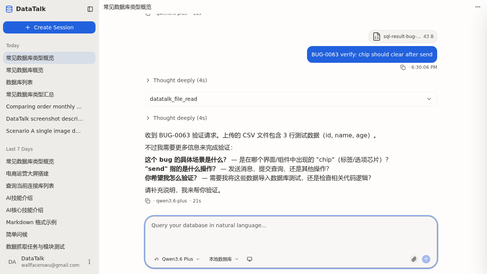

## Summary

`prompt-composer.tsx` 的 `submitText` 把 `clearDone()` + `evictDataUri()` 放在 `await sendMessage(parts)` 之后。`sendMessage` 内部走 `consumeSseStream` 直到 SSE 流闭合（即 AI 整段回答跑完）才 resolve，导致回车发送后输入框里的文件 chip 一直保留，直到 AI 全部说完才被清掉。用户体感是"消息发出去了，气泡也显示了，但输入框还挂着一个没用的 chip"。

## Reproduction Steps

1. 启动前端 + 后端，进入任一带 active session 的会话页
2. 通过 Paperclip 按钮上传一个文件（任意类型，CSV/PNG/SQL 等均可）
3. 输入文本，按 Enter 发送
4. 观察输入框底部的文件 chip：在 AI 进入 streaming（红色 abort 按钮）期间，chip 仍可见
5. 等到 AI 流式回复完全结束后，chip 才消失

## Expected vs Actual

- **Expected**：回车按下、用户气泡上屏的瞬间，输入框里的文件 chip 应当立即清除（chip 表示"待发送附件"，消息已发出意味着 chip 使命结束）
- **Actual**：chip 保留整个 AI streaming 时长（数秒至数分钟）。气泡顶上的文件由 OpenCode 回声 FilePart 渲染，与本地 chip 状态独立——气泡能正常显示，但输入框的 chip 残留误导用户

## Environment

- Backend commit: `0644cf31` (develop)
- Frontend commit: `0644cf31` (develop)
- OS / Browser: WSL Ubuntu / Chromium (Playwright dev profile, 1420)
- 网络：本机回环
- Data source: N/A（任何数据源/无数据源场景均复现）

## Evidence

用户报告原文（2026-05-18）：

> AI 输入框我上传了文件，然后回车，但是我 AI 输入框的文件还是的（在的）

用户截图（D:\bug图片.png）：气泡顶上显示 `sql-result-1-… 20.0 KB`，AI 正在 streaming（datatalk_file_read 工具调用进行中），输入框底部仍挂着同一个 `sql-result-1-… 20.0 KB` chip。

代码现场 — `client/src/features/session/prompt-composer.tsx:398-405`（修复前）：

```ts
const ok = await sendMessage(parts)   // await spans the entire SSE stream
if (ok) {
  clearDone()
  for (const fileId of imageFileIds) evictDataUri(fileId)
}
```

`useChannel.sendMessage` → `client.sendMessage` → `streamingPost` → `consumeSseStream` 内部 `for (;;) { reader.read() }` 直到流闭合才返回（`client/src/services/channel/channel-client.ts:128-146`）。

修复后端到端验证截图：

-  — AI 已回复完毕，输入框为空、无任何 chip 残留

## Root Cause

`submitText` 用 `await sendMessage(parts)` 来知道发送是否成功，再决定是否清 chip。问题在于 `sendMessage` 的 await 并非"消息已派发"，而是"SSE 流已结束"：

- `useChannel.sendMessage` 同步前导（`upsertPendingUser` 插入 pending 气泡 + `setStreaming(true)`）→ `await client.sendMessage(parts, sink)` → 等 SSE 流闭合 → finally `setStreaming(false)` → return
- 所以 `await sendMessage` 的语义实际上是"等到 AI 全部说完"

而 chip 的产品语义是"待发送附件"：消息一旦派发，pending bubble 已经出现，chip 的使命就结束了。无论后续 SSE 是否成功，本地 chip 都不该再留着——失败重试由 pending bubble 自己承担（`useChannel.retryPendingUser`），与本地 chip 状态独立。

`upsertPendingUser` 只接受 text 参数（`client/src/stores/chat-parts-store.ts:319-365`），但用户气泡的文件来自 OpenCode 后续回声的 FilePart，所以清掉本地 chip 完全不影响气泡渲染。

## Fix (applied 2026-05-18)

把 `clearDone()` + `evictDataUri()` 移到 `await sendMessage(parts)` **之前**，并去掉 `if (ok)` 守门：

```ts
// Clear chips BEFORE awaiting sendMessage — its await spans the entire SSE
// stream (AI streaming end), and gating clearDone behind it would keep the
// chip on screen for the whole AI response window. The user bubble hydrates
// from echoed FileParts (independent of local chip state), and a failed
// send is owned by the pending bubble's retry path — neither needs the
// chip preserved here. evictDataUri frees the cached base64; parts already
// captured `url`, so eviction now is safe.
clearDone()
for (const fileId of imageFileIds) evictDataUri(fileId)

await sendMessage(parts)
```

- `clearDone()` 只清 `status === 'done'` 的附件，error 状态的 chip 仍保留供用户移除/重试，与之前一致
- `evictDataUri()` 仅释放 base64 缓存，parts 数组已捕获 `url` 字段，eviction 后发送链路不受影响
- 失败路径未变：`useChannel.sendMessage` catch → `markPendingUserFailed` → 用户在 pending bubble 上点重试，行为与原先一致

## Verification

**前端类型检查**：

```bash
cd client && npx tsc --noEmit
# 仅遗留无关错误：sql-result-export.ts(5,10) / (22,10) 两处 unused import（与本次修改无关）
```

**焦点单测**：

```bash
cd client && npx vitest run \
  src/features/session/__tests__/prompt-composer.test.tsx \
  src/features/session/useFileUpload.test.ts
# 25/25 pass（15 prompt-composer + 10 useFileUpload）
```

**Playwright 端到端验证（2026-05-18）**：

1. `playwright-cli open http://localhost:1420` → 选 "常见数据库类型概览" session
2. 点 Paperclip → upload `/tmp/sql-result-bug-test.csv`（43 B 测试 CSV）
3. 输入 "BUG-0063 verify: chip should clear after send" → Enter
4. 断言 1：streaming 中（AI "Thinking…"）取 composer snapshot，`group [ref=e498]` 子节点仅剩 `textbox` + `group [ref=e500]`（按钮组），**没有 chip wrapper**（修复前应保留 `generic ref=e518` 内含 chip + Remove 按钮）
5. 断言 2：AI 回复完毕后再次确认输入框为空（见上方截图 evidence）

修复有效：chip 在 streaming 开始的瞬间就被清掉，符合 product expectation。

## Notes

- 与 BUG-0059 同属"composer 文件上传链路体验"主题，但根因独立：0059 是 lazy upload 导致回车前没开始上传；本 BUG 是 clearDone 时机贴在 SSE 完成态。两者都需要修
- 优先级 P2 因：消息实际送达正常、AI 也能正常回复，仅 chip 残留误导用户认为附件未发出；属 UX 问题不是功能 BUG
- 不打算把 `clearDone` 完全去掉 try 块：保留它在 `submitText` 的合理位置（在 size guard 通过后、发送前），既不破坏失败语义，也让"派发即清"成为显式不变量
