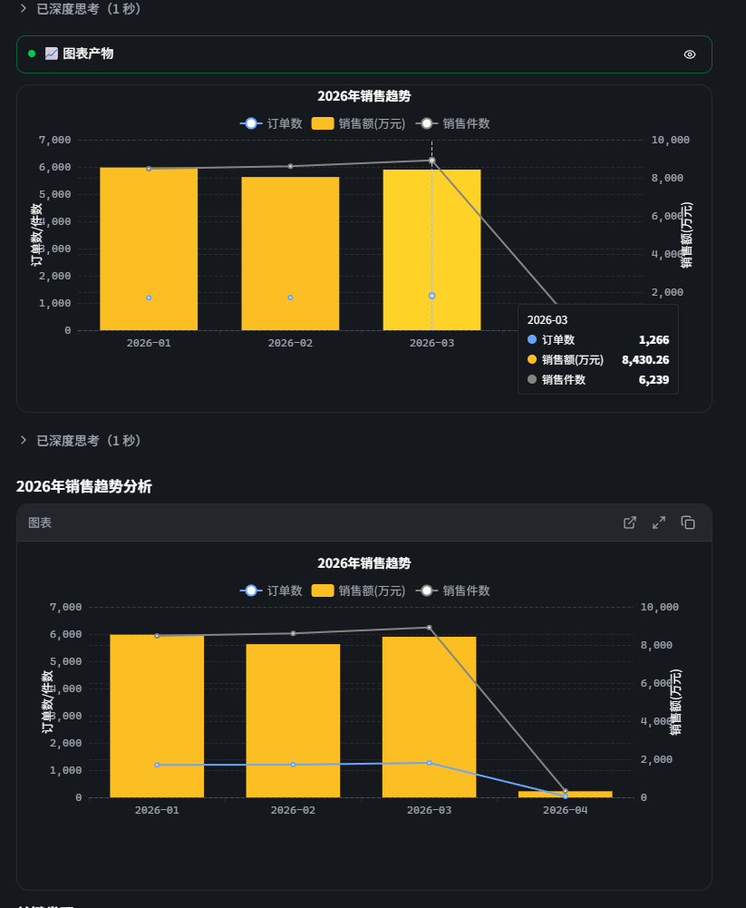

## Summary

LLM 同一回复里既调用 `datatalk_render_chart` 生成 chart artifact，又在 markdown 文本中嵌入 ```` ```echarts {...} ``` ```` 代码块，前端两条独立的渲染路径（`ArtifactCreated` + `ChartBlock`）就会把同一份 echarts option 渲染两次：上方"图表产物"卡片只带"眼睛"图标，下方独立 chart-block 带放大 / 复制 / 外链三个图标，能力不一致让用户困惑。

## Reproduction Steps

1. 在 chat 中向 AI 发"分析销售趋势"等会触发图表的查询。
2. AI 完整走完 schema_search → read_schema → execute_sql → render_chart 流程后，**同时**在文字回复 markdown 里贴一段同内容的 ```` ```echarts ... ``` ```` 代码块。
3. 滚动 chat 气泡。

## Expected vs Actual

- **Expected**: 同一份 chart option 在 chat 内**只渲染一次**；用户能从同一张图触达放大 / 复制 / promote-to-stage 等所有操作。
- **Actual**: 同一图被画两次：
  - 顶部 `ArtifactCreated` 卡片（标题 "📈 图表产物" / artifact title + 仅"眼睛 / 在 Stage 中查看"按钮）
  - 紧接着 markdown 内 `ChartBlock`（标题 "图表" + 放大 / 复制 / 外链 promote 三个按钮）
  两者数据完全一致，但能力不对等，用户被迫从下方的 chart-block 才能放大或复制。

## Environment

- Backend commit: 5c51634d
- Frontend commit: 5c51634d (tauri.conf.json version 0.1.0)
- OS / Browser: WSL2 Ubuntu / Tauri dev (Vite @ http://localhost:1420)
- Data source: MySQL 8.x（用户原始截图为 test_store；E2E 复现库为 test_metrics）

## Evidence

- 
- 复现日志：`/home/wallfacers/.local/share/opencode/log/2026-05-18T171646.log` 17:36 段，工具调用序列 `get_data_context → schema_search → read_schema → execute_sql → render_chart` 完整通过

## Root Cause

两条独立的渲染路径，没有 dedupe：

1. `client/src/features/chat/components/tools/renderers/artifact-created.tsx:70-108`
   `datatalk_render_chart` 完成时，渲染 `BasicTool`（带眼睛图标）+ 下面挂一份 `<ChartRenderer option={echartsOption} />`。
2. `client/src/features/chat/components/markdown/chart-block.tsx:221-289`
   Markdown 内的 ```` ```echarts``` ```` 代码块走 `ChartBlock`，自带 expand / copy / promote 三按钮 + `<ChartRenderer>`。

如果 LLM 既调 `render_chart` 又把同图 JSON 贴进文字（当前 prompt 没禁止），两条路径同时触发，造成肉眼可见的重复。`ChartBlock` 已经有 `sourceArtifactId` / `matched` 概念可以识别已 promote，但目前**只用于把 promote 按钮文案改为 "alreadyInWorkbench"**，并未跳过渲染。

## Fix

两个层面都可以收口，建议组合实施：

1. **Prompt 侧**（首选，治本）：在 `skills/render-chart-output` 或 `charts-and-dashboards` SKILL.md 增加硬约束 — 调用 `datatalk_render_chart` 后**禁止**再在 markdown 中嵌入同图的 ```` ```echarts``` ```` 代码块。
2. **前端侧**（兜底）：在 `ChartBlock` 里，当 `matched`（即同一 messageId / partId 已经有 chart artifact）时跳过自身的 ChartRenderer 渲染，仅保留 promote / expand / copy 控件，或者直接折叠为一个"图表已在上方展示"链接。需为 `ChartBlock` 增加 `data-dedup-skipped` 单元测试 + 现有 chart-block 测试集回归。
3. 统一两条路径的工具栏：要么 `ArtifactCreated` 也带放大 / 复制按钮（重用 `ChartBlock` 的 toolbar 组件），要么 `ChartBlock` 在被 dedup 时把这三个能力让给 `ArtifactCreated`（这点不是 BUG 本身，但顺手收齐 UX）。

## Verification

- 在 chat 中触发"分析销售趋势"，确认 chat 气泡中**仅渲染一次** echarts 图。
- 该图同时可用"放大 / 复制 / 在 Stage 中查看"。
- `chart-block.test.tsx` 新增 case：当 ontology store 内存在同 `originMessageId+originPartId` 的 chart artifact 时，`ChartBlock` 不再二次渲染 `<ChartRenderer>`。

## Notes

- 与 [BUG-0010](BUG-0010-chart-axis-name-clipped-in-chat-bubble.md) 同模块（chat + markdown + chart）但根因不同，前者是单图布局，本 BUG 是双路径并发。
- 关联 prompt 改造：本仓库 `agent-context-priming` change 已落地 Pre-Action Exploration Protocol，prompt 层修改建议放进后续小 change，不阻塞当前 PR archive。
