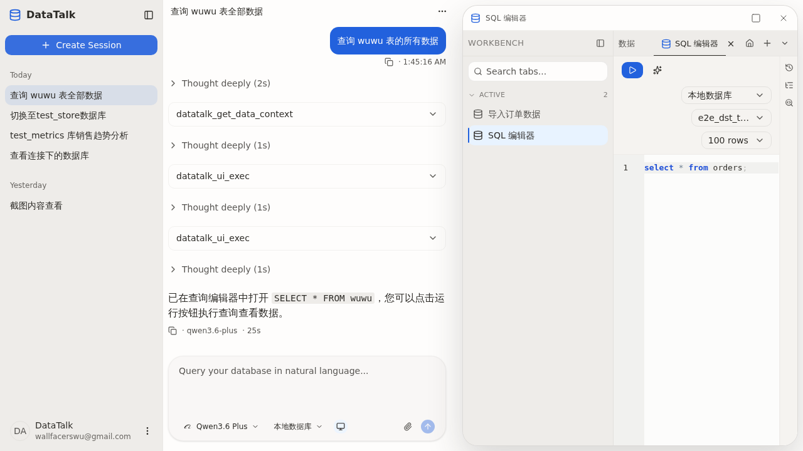

## Summary

`agent-context-priming` change 落地的 Pre-Action Exploration Protocol（AGENTS.md L22-L31）要求 LLM 在 SQL 触达任何不熟悉的表前必须 `schema_search → read_schema`，连续 3 次探索未命中要调 `question` tool。但当 LLM 选择 `datatalk_ui_exec object=query_editor action=...` 路径把 SQL 推到编辑器、把执行决策交给用户时，整条 Protocol 被静默绕过——LLM 既不 `schema_search` 也不 `question`，直接把潜在不存在表名的 SQL 写入编辑器。

## Reproduction Steps

1. 启动后端 + Tauri dev，在已有 MySQL 连接（test_metrics 库可见多张 t_* 表）下创建新 session。
2. 在 composer 发：`查询 wuwu 表的所有数据`（test_metrics 库实际不存在 `wuwu` 表）。
3. 观察工具调用序列（OpenCode log）。

## Expected vs Actual

- **Expected**:
  1. `datatalk_get_data_context` → 确认绑定 connection 与 database
  2. `datatalk_schema_search('wuwu')` → 命中 0
  3. 3 misses 后调 `question` tool 询问用户："找不到 wuwu 表，您指的是哪个？"
- **Actual** (`/home/wallfacers/.local/share/opencode/log/2026-05-18T171646.log` 17:45:23-17:45:40 段)：
  1. `datatalk_get_data_context`
  2. `datatalk_ui_exec` × 2（open query_editor + 写 `SELECT * FROM wuwu`）
  3. AI 回复："已在查询编辑器中打开 SELECT * FROM wuwu，您可以点击运行按钮执行查询查看数据。"
  - 没有任何一次 `schema_search` / `read_schema`；执行风险被前端运行按钮承担。

## Environment

- Backend commit: 5c51634d
- Frontend commit: 5c51634d (Tauri dev / Vite @ http://localhost:1420)
- OS / Browser: WSL2 Ubuntu / Chromium headless
- Data source: MySQL 8.x（连接 `cb2d0259-edd5-4091-873b-6cfee09eec1a`，无 wuwu 表）

## Evidence

- 工具调用日志片段（截取关键行）：
  ```
  17:45:23 permission=datatalk_get_data_context
  17:45:32 permission=datatalk_ui_exec
  17:45:40 permission=datatalk_ui_exec
  ```
- 

## Root Cause

Pre-Action Protocol 把硬约束放在 SQL "执行" 边界（execute_sql / DDL 提交），但没显式覆盖 SQL "落盘" 边界（ui_exec / ui_patch 把 SQL 写入 query_editor）。`skill:query-editor-workflow` 教 LLM 用 `ui_exec / ui_patch` 操作编辑器，但全文没要求"写入编辑器的 SQL 也要先经过 schema_search 的 sanity check"，所以 LLM 把"不确定的 SQL 转嫁给用户运行"当成合规出路。

## Fix

两处加硬约束，二选一或叠加：

1. **AGENTS.md `Pre-Action Exploration Protocol` 段**（L22）的"unfamiliar table"判定扩到"任何把 SQL 输出到 chat / 编辑器 / 用户的路径"，明确点名 `datatalk_ui_exec`、`datatalk_ui_patch`、markdown SQL fenced block 都受同等约束。Trigger Gate L161 行同步补一句"about to write SQL via `ui_exec` / `ui_patch` / markdown fenced block on an unfamiliar table → skill:exploring-data"。
2. **`skill:query-editor-workflow` SKILL.md**：在"open / set_context / write / run_sql" 五步之前插一段 "Pre-flight: if the SQL references any table you have not `read_schema`'d in this session, run `schema_search` first and fall through to `[[exploring-data]]` if it misses"。

附加：`AgentsTemplateContractTest` 加一行断言："Pre-Action Exploration Protocol section MUST mention ui_exec/ui_patch path" 防止 prompt 退化回旧版。

## Verification

- 同一输入"查询 wuwu 表的所有数据" → LLM 必须先调 `datatalk_schema_search`，0 命中后第 3 次起调 `question` tool 询问用户。
- 同一输入"查询订单数据" → 因为 test_metrics 库存在 `t_ord_hdr`，LLM 必须先 `schema_search('订单')` → `read_schema('t_ord_hdr')` → 才能向编辑器写 SQL。
- 单元测试覆盖：`AgentsTemplateContractTest` 新增断言。`ExploringDataSkillContentTest`（若存在）补一个 case 验证 Protocol 显式 cover ui_exec 路径。

## Notes

- 与 [BUG-0064](BUG-0064-chart-artifact-rendered-twice-when-llm-also-embeds-echarts-block.md) 一同来自 `agent-context-priming` change 的 E2E 验证，都不阻塞 PR archive，但应该在 follow-up 小 change 一起收口。
- 这是"Protocol 漏洞"而非代码 bug — 修复成本主要在 prompt + 一两条契约测试。

## Fix Summary（commit eb1ef5a8）

- **AGENTS.md `## Pre-Action Exploration Protocol`**：新增 "Scope — all SQL-emit paths are covered" 段，明确列出 `datatalk_execute_sql` / `datatalk_ui_exec(object=query_editor)` / `datatalk_ui_patch` / markdown SQL fenced block 四条等价路径；明确"把不确定 SQL 推到编辑器让用户运行"不是合规出路。
- **AGENTS.md Trigger Gate**：新增一行 — 即将通过 `ui_exec`/`ui_patch`/fenced block 写未确认表 → 必须先 load skill:exploring-data。
- **`skill:exploring-data`**：Pre-Action Protocol 第 4 步重写为 *Emit SQL*，枚举四条路径；新增 "Scope: all SQL-emit paths" 段把编辑器场景显式吸进 protocol。
- **`skill:query-editor-workflow`**：在 "Editor lifecycle" 之前插入 "Pre-flight" 段，强制 SQL 写入编辑器前要 schema_search/read_schema。
- **测试**：`AgentsTemplateContractTest.agentsTemplatePreActionProtocolCoversUiExecAndUiPatchPaths` 和 `exploringDataSkillCoversAllSqlEmitPaths` 两条契约断言守门。后端 308/308 全过。
