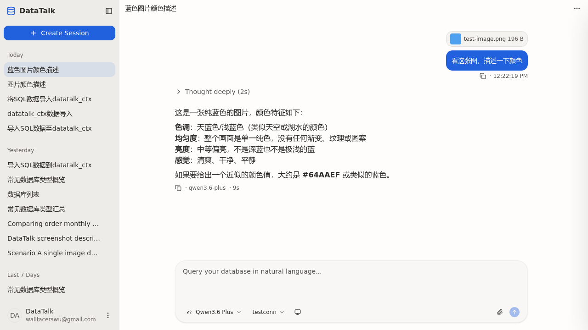

## Summary

提交 `0893d6de`（fix(chat): eliminate user bubble jitter when sending with file attachments）修好了"附件不在首帧渲染"的抖动，但同时把 `promotePendingUser` 改为**清空 `partsBySession[realId]`**，等待 SSE `message.part.created` 慢慢回填真实 parts。结果 SSE 推回真实 text/file_upload 之前那一帧，气泡虽然 `infoBySession` 还在（保留为 user role），但 `partsBySession[realId]` 是空数组——`UserBubble` 通过 `parts.find(type==='text')` 拿不到 text，`parts.filter(type==='file_upload'|image)` 也拿不到附件——肉眼看就是**气泡里的文本与附件瞬间消失，紧接着 SSE 来 part.created 又重新展示**。

## Reproduction Steps

1. `cd server && mvn spring-boot:run -pl data-talk-adapter`
2. `cd client && npm run dev`
3. 浏览器打开 `http://localhost:1420/`，进入任意 session
4. 选择一个连接，在 composer 上传一张图片（任意 PNG/JPG）
5. 输入文本（如"看这张图"），点击发送
6. 观察用户气泡：**先看到文本+图片缩略图正确显示 → 短暂消失（白底无内容） → 文本和缩略图再次出现**

## Expected vs Actual

- **Expected**: 用户气泡的文本与附件从乐观渲染那一刻起持续可见，直到 SSE 真实 parts 在原位置无缝替换占位项；视觉上不应有"内容消失"的中间帧。
- **Actual**: 气泡内容在 `message.created`（promote）瞬间清空，等 `message.part.created` 一个个回来再填回，造成可见闪烁。

## Environment

- Backend commit: `0893d6de`（含 attachments first-frame 修复）
- Frontend commit: 同上
- Browser: Chromium via Playwright
- Data source: 任意（连接非必要——bug 不依赖 SQL 执行）

## Evidence

- 单测精确刻画问题：`client/src/stores/__tests__/chat-parts-store.test.ts` 中原测试断言 `expect(parts).toEqual([])`，即"promote 后 parts 期望为空"——这就是空白帧的来源。
- 关键代码位置：`client/src/stores/chat-parts-store.ts` 中 `promotePendingUser`：

  ```ts
  if (mid === pendingId) {
    nextPartsMap.set(realId, [])     // ← 制造空白帧
    continue
  }
  ```
- Playwright 端到端采样（修复后）：在 `[data-pending-user-motion]` 与 user bubble DOM 上每 16ms 采样气泡文本和图片数，整轮发送 1265 帧均满足 `text 非空 && imgs == 1`，pending→正式态切换无 `imgs=0` 帧、无重复 chip。
- 截图（修复后）: 

## Root Cause

`promotePendingUser` 把 `partsBySession[realId]` 设为 `[]`，原意是"避免 pending_prt_ + 真实 prt_ 同时存在导致附件 chip 重复"。但 SSE 真实 parts 的到达必然滞后于 `message.created` 触发的 promote，于是产生一帧"消息壳子在、内容不在"的中间态。

修复前（`0893d6de` 之前）的 `promotePendingUser` 把 pending parts 整体迁移到 `realId`（仅改 messageID），所以没有空白帧；但当时 pending 只含 text，且 `UserBubble` 对 text 用 `find` 只取第一个，所以即使 SSE 后续追加同语义 text part 也不会渲染重复。`0893d6de` 引入 pending file_upload 后，`UserBubble` 对 file_upload 走 `filter` 全取，**才**有重复风险——但作者的解法过度，直接清空了所有 pending parts（包括 text）。

## Fix

`client/src/stores/chat-parts-store.ts`：

1. `promotePendingUser`：恢复"保留 pending parts、整体改写 messageID 到 realId"的迁移行为，避免空白帧。
2. 新增 `findMatchingPendingPartIdx(list, incoming)` 工具：
   - `text`: 按 `type==='text' && id.startsWith('pending_prt_')` 匹配（每条 user message 至多一个 text part）。
   - `file_upload`: 按 `fileId` 匹配（legacy 路径，CSV/JSON/SQL 与无 dataUri 的图片走 `publishPendingFileUploadEcho` 回放）。
   - `file` (mime image/*): **跨类型替换**。image-with-dataUri 路径上 `ChannelService.partForWire` 把 `FileUploadPart` 转成 OpenCode 原生 `FilePart`，SSE 推回 `type='file'` + `mime=image/*`——按 `filename` 匹配同 messageID 下的 image `file_upload` placeholder（filename 为空时回落到第一个 image placeholder）。
3. `upsertPart`：当新 part 按 id 找不到匹配项且自身不是 `pending_prt_` 开头时，回退到上面的 type/fileId 匹配——找到就**原位置替换** pending placeholder（同时把 partIndex 中 pending id 项删掉、加入真实 id 项）；找不到再 push。

这样：
- promote 期间 pending parts 一直可渲染，**无空白帧**。
- SSE 真实 parts 在原位置无缝接管，**无重复**——image-with-dataUri 路径也覆盖了 `file_upload → file` 跨类型替换。
- partIndex 一致：后续 `message.part.delta` / `message.part.removed` 仍能按真实 id 命中。

## Verification

- 单测 `client/src/stores/__tests__/chat-parts-store.test.ts`：
  - `promotePendingUser renames pendingId → realId and keeps pending parts visible until SSE swaps them in place`
  - `image-with-dataUri path: pending file_upload (image/*) is replaced by SSE-echoed native FilePart, not duplicated`
  - `promotePendingUser preserves pending file_upload parts; SSE echo replaces by fileId`
- `npx vitest run` 全量 38 文件 / 316 用例通过；`npx tsc --noEmit` 零错误。
- Playwright 端到端（http://localhost:1420 真实前后端）：
  - 新建 session → 选 testconn → 上传 64×64 PNG → 文本"看这张图，描述一下颜色" → 发送。
  - 每 16ms 采样 1265 帧：`text 非空` 且 `imgs == 1` 恒为 true；pending→正式态切换间无任何零文本或零图片帧。
  - 修复前同样脚本观测到 `imgs` 集合 `[1, 2]`（重复 chip）与"text 短暂为空"的现象，修复后两类异常均消失。

## Notes

回归来源：`0893d6de` 引入 pending file_upload 与 `promotePendingUser` 清空 parts 的耦合改动。若日后再添加新 pending part 类型（如 base64 inline image），需在 `findMatchingPendingPartIdx` 中补对应的匹配键（建议沿用稳定标识符，如 `fileId`）。
