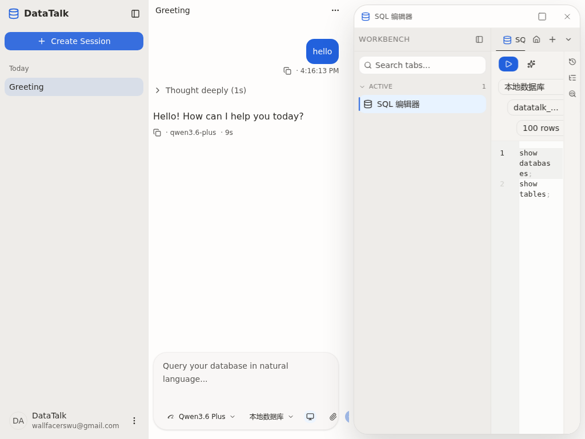

## Summary

工作台（Stage）从打开切换到关闭的 240ms 过渡动效里，chat 列底部 composer 外壳容器在几帧内闪出一条水平滚动条，随即消失。根因是 `split-view.tsx` 中 composer 外壳 `<div>` 只写了 `overflow-y-auto` 而没有配套 `overflow-x-hidden`，命中 CSS Overflow L3 §3：当 `overflow-y` 非 visible 且 `overflow-x` 未指定时，`overflow-x` 计算为 `auto`。

## Reproduction Steps

1. 启动 client (`cd client && npm run dev`)；在浏览器打开 `http://localhost:1420/`
2. 进入任意已有会话，确认底部 composer（输入框 + 模型选择 + 数据源选择 + 工作台开关 + 附件 + 发送按钮）渲染完毕
3. 点击 composer 上的工作台开关，让 Stage 滑入；再次点击关闭，让 Stage 滑出
4. 观察 chat 列底部 composer 容器区域在 240ms 过渡过程中是否短暂出现一条水平滚动条

## Expected vs Actual

- **Expected**: 关闭工作台过程中 chat 列布局变更平滑，不应出现任何瞬现/瞬消的水平滚动条
- **Actual**: 关闭瞬间 composer 外壳容器底部闪出一条水平滚动条，约 100~200ms 后随 chat 列宽度增长到能容纳内部 toolbar 后消失

## Environment

- Frontend commit: 429024c7（develop, 2026-05-19）
- Backend commit: 同上
- OS / Browser: WSL2 + Chromium via playwright-cli
- Data source: N/A（纯前端布局 bug，与数据源无关）

## Evidence

-  — composer footer toolbar 右侧（发送按钮）被工作台覆盖，外壳容器实际 `scrollWidth=367 > clientWidth=341`，`overflow-x` 计算值为 `auto`（CSS L3 §3 命中）
-  — 同样视口与布局，`overflow-x` 计算值为 `hidden`，关闭过渡全程无横条
- playwright-cli 关闭过渡采样（每 30ms 一帧，1024×768 视口、Stage 打开）：

  修复前：

  ```
  t=  0ms  scrollWidth=367  clientWidth=341  hasH=true   ← 滚动条存在
  t= 30ms  scrollWidth=367  clientWidth=341  hasH=true
  t= 60ms  scrollWidth=409  clientWidth=409  hasH=false  ← chat 增宽到能容纳 toolbar，横条消失
  t= 90ms  scrollWidth=557  clientWidth=557  hasH=false
  ...
  t=360ms  scrollWidth=754  clientWidth=754  hasH=false
  ```

  修复后：

  ```
  t=  0ms  overflowX=hidden  hasH=false  ← 整段过渡 overflowX 始终 hidden，13 帧无横条
  ...
  t=360ms  overflowX=hidden  hasH=false
  ```

## Root Cause

`client/src/features/session/split-view.tsx` 中，chat 列 composer 外壳容器（line 208，hasMessages 分支）：

```tsx
<div className="overflow-y-auto px-2 pt-1 pb-4" style={{ scrollbarGutter: 'stable' }}>
  <div id="composer-slot" className="mx-auto w-full min-w-0 max-w-3xl" />
</div>
```

以及空态分支（line 215）：

```tsx
<div className="flex flex-1 flex-col items-center justify-center overflow-y-auto px-2" style={{ scrollbarGutter: 'stable' }}>
```

两处均只声明 `overflow-y-auto`。按 CSS Overflow Module Level 3 §3，**当 `overflow-y` 计算为非 visible 且 `overflow-x` 未指定时，`overflow-x` 的计算值会被强制改为 `auto`**。也就是说外壳容器实际是 `overflow: auto`，内部 composer 内容（model picker + data source picker + stage toggle + spacer + 附件 + send 按钮的 flex 行）一旦宽度超过当前外壳宽度，浏览器就会渲染一条水平滚动条。

工作台打开时 chat 列宽度仅约 46%，composer footer toolbar 极易超宽并已经产生水平滚动条，但用户视线被右侧刚滑入的 Stage 吸走，没人注意。关闭瞬间 chat 列 240ms 内从 46% 长到 100%，水平滚动条会持续到容器宽度足够容纳内部 toolbar 才消失——观感上就是「瞬现一下又收回去」。

讽刺的是，同文件第 150 行的消息列表 scroller 已经针对同一 CSS 陷阱做了 `overflow-x-hidden` 防御，并附了 9 行注释（line 151-159）详细解释为什么必须加。**同一 doctrine 上半截贴了护身符，下半截两处都忘了贴。**

## Fix

`client/src/features/session/split-view.tsx`：

1. hasMessages 分支 composer 外壳（line 208 → 修改后 line 214）补 `overflow-x-hidden`，并在容器前补一段短注释指回上方消息列表 scroller 同 doctrine 的长注释，避免下次有人忘贴：

   ```tsx
   // 修改前
   <div className="overflow-y-auto px-2 pt-1 pb-4" style={{ scrollbarGutter: 'stable' }}>
     <div id="composer-slot" className="mx-auto w-full min-w-0 max-w-3xl" />
   </div>

   // 修改后
   {/* `overflow-x-hidden` — same CSS Overflow L3 §3 trap as the
       chat scroller above ... Mandatory, not optional. */}
   <div className="overflow-x-hidden overflow-y-auto px-2 pt-1 pb-4" style={{ scrollbarGutter: 'stable' }}>
     <div id="composer-slot" className="mx-auto w-full min-w-0 max-w-3xl" />
   </div>
   ```

2. 空态分支同位置 hero 容器（line 215 → 修改后 line 222）也补 `overflow-x-hidden`：

   ```tsx
   // 修改前
   <div className="flex flex-1 flex-col items-center justify-center overflow-y-auto px-2" style={{ scrollbarGutter: 'stable' }}>

   // 修改后
   <div className="flex flex-1 flex-col items-center justify-center overflow-x-hidden overflow-y-auto px-2" style={{ scrollbarGutter: 'stable' }}>
   ```

修复后内容仍会溢出（composer toolbar 在窄列下天然 > 容器宽），但浏览器以裁切代替滚动条，符合用户预期（关闭工作台时不该出现一闪而过的水平滚动条）。toolbar 内容在窄列下被裁切是另一个独立的可用性问题，归类到结构级修复（B 方向，未在本次范围内）。

## Verification

1. **类型检查**：`cd client && npx tsc --noEmit` — 通过，无错误
2. **E2E 复现 → 修复 → 验证（playwright-cli, 1024×768 视口，已发送过消息的 session）**：
   - 修复前：Stage 打开瞬间到关闭过渡 t=0~30ms 共两帧 `hasH=true`（水平滚动条存在），t≥60ms 消失
   - 修复后：整段 13 帧 close 过渡 `overflowX="hidden"`，全程无横条
3. **人工验证**：用户已查看代码 + 截图，确认修复有效（"验证了没问题代码"）

## Notes

- 这次属于"已知 CSS doctrine 在邻近代码漏贴"，不是新的设计陷阱
- split-view.tsx:151-159 那段长注释覆盖了完整 doctrine，本次修复在 composer 外壳前补了一条短注释 + 链接回上方注释，作为本地化提醒；未抽成全仓工程纪律（client/DESIGN.md）
- 后续若再发现同类容器漏贴，建议升级为 client/DESIGN.md 的一条工程纪律 + ESLint 自定义规则巡检
- toolbar 在窄列下被裁切是独立的可用性议题（结构级修复 B 方向），不在本次范围内
