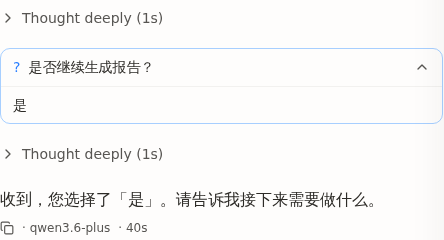

## Summary
`question-tool-bridge` 为已完成的 question 工具部件写了自定义渲染器 `renderers/question.tsx`（标题=问题文本、内容=用户所选 label），但从未在 `renderers/index.ts` 的 `registerBuiltInRenderers()` 注册，导致 `ToolRegistry.get('question')` 返回 undefined，部件回退到 `GenericTool`，只显示原始 output 文本（`User has answered your questions: "…"="…"`）和裸标题 "question"。

## Reproduction Steps
1. 新建会话，发送让 AI 调用 `question` 工具的 prompt（如「请直接调用 question 工具确认是否继续」）。
2. 在 QuestionDock 中作答（如选「是」）→ turn 继续。
3. 展开消息流中已完成的 `question` 工具卡。

## Expected vs Actual
- **Expected**: 卡片标题为问题文本「是否继续生成报告？」，卡片内容展示用户所选 label「是」（多子问题时逐题展示）。
- **Actual**: 卡片标题为裸 "question"，展开后只显示 OpenCode 原始 output 串 `User has answered your questions: "是否继续生成报告？"="是". You can now continue…`。

## Environment
- Backend commit: bb80213f
- Frontend commit: bb80213f (working tree, question-tool-bridge WIP)
- OS / Browser: WSL2 / Chromium (Playwright)
- Data source: N/A（不涉数据源）

## Evidence
-  — 注册后重载，卡片标题=问题文本、内容=所选 label「是」

## Root Cause
`renderers/question.tsx` 导出了 `Question` 组件，但 `renderers/index.ts` 的 `registerBuiltInRenderers()` 没有 `ToolRegistry.register('question', Question)`。`tool-part.tsx` 通过 `ToolRegistry.get(part.tool) ?? GenericTool` 解析渲染器，未注册即静默回退 GenericTool。tasks.md 6.2 标记完成但实际接线缺失。

## Fix
`renderers/index.ts` 新增 `import { Question } from './question'` 与 `ToolRegistry.register('question', Question)`。

## Verification
E2E 重新触发 question → 作答 → 重载（CTRL+R 重建）后，已完成卡片标题正确显示问题文本、内容显示所选 label「是」。`npx tsc --noEmit` 零错误。

## Notes
本缺陷在 `question-tool-bridge`（未归档）的 §8.1 E2E 验证中发现并就地修复。归档前 tasks.md 6.2 接线已补齐。
