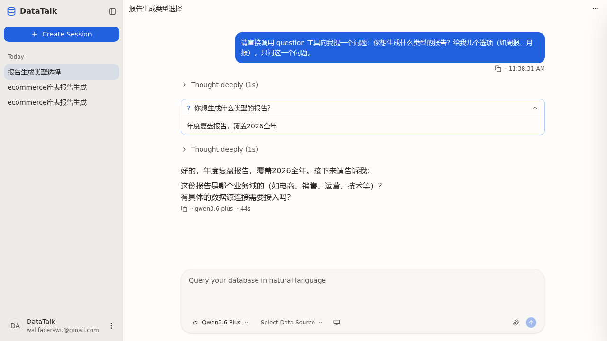

## Summary
`QuestionDock` 用 `singleShortcut = total === 1 && !multi` 做了一个"单问题单选秒提交"优化：选项点选直接 `submitAnswers([[label]])`，并把 footer 的"提交/下一步"按钮整个隐藏（`{!singleShortcut && <Button/>}`）。但该假设漏掉了"自定义输入答案"路径——当用户在单问题单选场景下选择"自定义输入"、在 textarea 输入内容并按 Enter 时，代码只 `setEditing(false)` 收起输入框，**不会提交**；而此时提交按钮被 `singleShortcut` 隐藏，导致没有任何"下一步"入口，整个提问流程卡死。

## Reproduction Steps
1. 新建会话，让 AI 调用 `question` 工具发出**单个**单选问题（如「你想生成什么类型的报告？」附若干选项）。
2. 在 QuestionDock 中点击「自定义输入答案」，在文本框输入自定义内容。
3. 按 Enter，或试图寻找提交按钮。

## Expected vs Actual
- **Expected**: 输入自定义答案后存在明确的提交入口（按钮 / 快捷键），提交后 turn 继续。
- **Actual**: Enter 仅收起输入框；footer 无"提交"按钮（被 `singleShortcut` 隐藏）；用户无法把自定义答案发出，流程卡死。

## Environment
- Frontend commit: e84644c5（working tree 修复）
- Backend commit: e84644c5
- OS / Browser: WSL2 / Chromium (Playwright)
- Data source: N/A（不涉数据源）

## Evidence
-  — 修复后单问题选「自定义输入」输入「年度复盘报告，覆盖2026全年」→ 点 Submit → turn 继续（AI 回复「好的，年度复盘报告…接下来请告诉我…」）

## Root Cause
`client/src/features/session/question-dock/question-dock.tsx` 的 `singleShortcut` 优化把提交职责完全绑定在"点选项自动提交"上，而自定义输入这条分支没有对应的提交触发点，同时提交按钮又被该标志隐藏，形成死角。对照 OpenCode 参考实现（`opencode/packages/app/src/pages/session/composer/session-question-dock.tsx`）：提交按钮始终常驻、选项点选从不自动提交、所有路径统一汇聚到 Submit / `Cmd+Enter`，因此自定义输入永远有出口。

## Fix
按方案 B 完全对齐 OpenCode，改 `question-dock.tsx`：
1. 删除 `singleShortcut` 概念。
2. `pickOption` 单选分支不再自动提交，仅 `setAnswerAt(tab, [label])`。
3. footer 的"提交/下一步"按钮始终渲染（移除 `{!singleShortcut && ...}` 包裹）。

提交统一靠 Submit 按钮或 `Cmd/Ctrl+Enter`（textarea 内 plain Enter 收起并落库草稿，答案已由 `onCustomInput` 实时同步）。

## Verification
`npx tsc --noEmit` 零错误。

**E2E（2026-05-21，playwright-cli，前端 1420 / 后端 8080 运行态）**：新建会话发送 prompt 触发 AI `question` 工具 → QuestionDock 显示单问题「你想生成什么类型的报告？」+5 选项+「自定义输入」，**Submit 按钮已常驻可见**（修复前会被隐藏）→ 点「自定义输入答案」→ textarea 输入「年度复盘报告，覆盖2026全年」（`value` 断言通过）→ 点 Submit → QuestionDock 消失（`DOCK_GONE`）、console 0 错误 → turn 继续：完成态问题卡内容含自定义答案「年度复盘报告，覆盖2026全年」，AI 回复「好的，年度复盘报告，覆盖2026全年。接下来请告诉我：…」。证据：`docs/bugs/assets/BUG-0086/custom-answer-loop-closed.png`。

## Notes
- 行为变更：单问题单选不再"点选项即提交"，需再点 Submit / `Cmd+Enter`。这与 BUG-0080 验证记录中描述的「选项自动提交」旧行为不同，属本次按方案 B 主动对齐 OpenCode 的预期变更。
